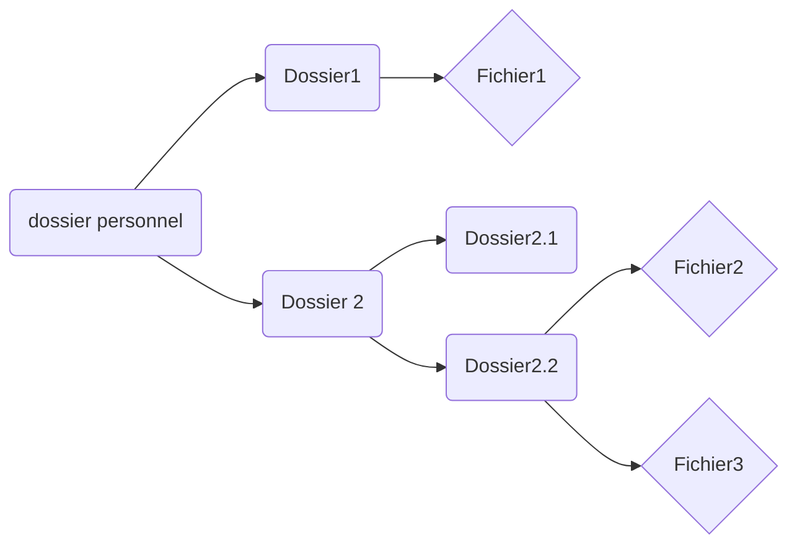

# TP 1 - Installation d’Ubuntu Server et prise en main du shell

## Prise en main de l'interprétateur de comande

### Manuel :

1. Afin de voir quels est le rôle de la commande which, on tape la commande « ***man which*** ». Le rôle de which : renvoie le chemin des fichiers (ou liens) qui seraient exécutés dans l'environnement courant si les arguments avaient été donnés comme commandes dans un interpréteur de commande strictement conforme à PSIX.

  

2. La commande « ***man which | grep option*** » permet de retourner les phrases du manuel pour la commande which contenant le mot « *option* ».

  

3.  La touche « ***q*** » permet de quitter le manuel.

  

4. « ***man 6 intro*** » commande qui présente les pages de manuels dans la section numéro 6, en l 'occurrence les petits jeux et programmes rigolos.
Chaque section du manuel possède une première page intitulé *intro*, faisant référence au contenu associé.

  

### Navigation dans l'arborescence des fichiers :

1.  Il faut utiliser la commande « cd / » pour revenir au plus haut point de l’arborescence, et la commande « ***cd /var/log*** » pour se rendre dans le dossier */var/log*.

  

2. Pour remonter dans l'arborescence, utilisez la commande « ***cd ..*** ».

  

3. la commande « ***cd*** » sans argument permet de retourner au dossier personnel.

  

4. « ***cd -*** » permet de retourner dans le dernier directory ou l’on se trouvait.

  

5. Si on essaye d’accéder au dossier */root* avec *cd /root* on obtient *Permission denied*. Car c’est un dossier aux droits réservés.

  

6. Si maintenant on essaye d’y accéder avec un *sudo*, cela demande le mot de passe de la session de l'utilisateur et ne fait pas la commande parce que cd est une commande bash (built-in) et *sudo* est un executable.  
Pour accéder au */root* il faut faire un « ***sudo su*** » puis « ***cd /root*** » en 2 temps.

  7. Pour créer l’arborescence donné o:

 On va avoir besoin de 2 commande **mkdir** afin de créer des dossiers et **touch** pour créer des fichiers, on tape donc les commandes suivante : 

> * mkdir ~/Dossier1
> * mkdir ~/Dossier2
> * touch ~/Dossier1/Fichier1
> * mkdir ~/Dossier2/Dossier2.1
> * mkdir ~/Dossier2/Dossier2.2
> * touch ~/Dossier2/Dossier2.2/Fichier2
> * touch ~/Dossier2/Dossier2.2/Fichier3

8. Avec la commande « ***rm Dossier1*** » la commande renvoie une erreur *`Dossier1 is a directory`*, car la commande **rm** ne sert qu’a supprimer les fichier et non dossier
Si maintenant on essaye de supprimer le fichier ***rm ~/Dossier1/Fichier1*** cela supprime bien ce fichier

  

9. La commande « ***rmdir*** » permet la suppression de dossier

  

10. Mais si on essaye de supprimer un dossier qui n’est pas vide avec « ***rmdir ~/Dossier2*** » on obtient : *`Error : Directory is not empty.`*

  

11.  Si on souhaite supprimer le dossier et tout son contenu il faut ajouter « ***rmdir -r Dossier2*** »

  

### Commandes importantes :

1. « ***date*** » permet l'affichage de la date et de l'heure.
Si on ne souhaite que l’heure il est possible de réaliser la commande « ***date +%H:%M*** »
La commande « time » permet d'afficher le temps de traitement d'une commande « time ls ».

  
		%H     heure (00..23)
        %I     heure (01..12)
        %k     heure ( 0..23)
        %l     heure ( 1..12)
        %M     minute (00..59)
        %p     notation locale pour AM ou PM.
        %r     heure actuelle (sur 12 heures) (hh:mm:ss [AP]M)
        %s     secondes écoulées depuis le 01-01-1970  à  00:00:00 T.U (extension non standard)
        %S     secondes (00..61)
        %T     heure actuelle, (sur 24 heures) (hh:mm:ss)
        %X     représentation locale de l'heure (%H:%M:%S)
        %Z     fuseau  horaire (par ex. MET), ou rien si le fuseau horaire n'est pas déterminé
        %a     abréviation locale du jour de la semaine (Sun..Sat)
        %A     nom local du jour de la semaine (Sunday..Saturday)
        %b     abréviation locale du nom du mois (Jan..Dec)
        %B     nom local du mois (January..December)
        %c     date  et  heure  locales  (Sat  Nov 04 12:02:33 EST 1989)
        %d     jour du mois (01..31)
        %D     date (mm/jj/aa)
        %h     comme %b
        %j     jour de l'année (001..366)
        %m     mois (01..12)
        %U     numéro de semaine dans l'année (00..53). La semaine commence le Dimanche.
        %w     Jour  de  la  semaine  (0..6).  Le  0 correspond au Dimanche.
        %W     numéro de semaine dans l'année (00..53). La semaine commence le Lundi.
        %x     représentation locale de la date (mm/jj/aa)
        %y     deux derniers chiffres de l'année (00..99)
        %Y     année (1970...)

  

2.  « **ls** » vois des dossiers et fichier dans le dossier courant.
« **la** », c'est comme *ls* mais avec les dossiers cachés en supplément, éuivalent à ***ls -A***.

  

3. Il est nécessaire d'utiliser la commande which afin d'obtenir le chemin de la comande associé, donc « ***which ls*** » permet de trouver le path de ls qui est : `/usr/bin/ls`.

  

4.  afin de voir le contenu de la command ell qui est un alias on peut simplement utiliser la commande « ***alias ll*** ». ll correspond à la commande « ***ls -l*** » et c'est un raccourci de commande créé par alias.

  

5.  « ***ls /bin*** » permet d’afficher les fichiers contenus dans le dossier */bin*.

  

6. La commande « ***ls ..*** » affiche le contenu du directory du dossier parent.

  

7. « ***pwd*** » donne le chemin complet du dossier courant.

  

8. `echo 'yo' > plop` : remplace le texte du fichier *plop* par le mot *yo* si fichier *plop* existe pas il le crée.

  

9. `echo 'yo' >> plop` : écrit à la suite du contenu déjà existant du fichier le mot '*yo*' (si le fichier existait pas le crée, et si le fichier vide écrit simplement à la suite).

  

10. ***File*** donne la nature du fichier cible par exemple : 

> sur un dossier file nom_dossier renvoie : « directory »

  

11. Après avoir modifié le fichier *toto*, le fichier *titi* créer de la façon « ***ln toto titi*** » renvoie exactement le contenu de *toto* modifié.
*Titi* garde le contenu de toto malgré la suppression de ce dernier.

  

12. Si on crée un fichier tutu avec ***ls -s titi tutu*** : le contenu de *tutu* a été modifié simultanément que le fichier *titi*
inversement si on modifie tutu, titi se retrouve modifié aussi
Si on supprime *titi*, alors *tutu* renvoie `no such file or directory` par le lien symbolique

  

13.  ***cat /var/log/syslog*** permet d’afficher le fichier *syslog* à l’écran, **ctrl + s** pour arrêter le défilement du texte et **ctrl + q** pour le reprendre.

  

14. `head /var/log/syslog -n 5` pour afficher les 5 premières lignes
`tail /var/log/syslog -n 15` pour afficher les 15 dernières
`sed -n '10,20p' /var/log/syslog` pour afficher les lignes 10 à 20 

  

15.  `dmesg | less`  : Affiche la mémoire tampon du processeur.

  

16. `cat /etc/passwd` : affiche les nom d'utilisateur, leur ID et leur emplacement de répertoire perso. « ***man passwd*** » pour affciher la page de manuel de ce fichier qui est standard

  

17. Pour affciher seulement la première colonne triée par ordre alphabétique inverse :
    ***cut -d : -f1 /etc/passwd | sort -d -r -b -f***

		* d pour alphabétique
		* r pour inverse
		* b pour ne pas prendre en compte les blancs en début de mots
		* f pour ne pas faire de différence entre majuscule et minuscule.

  

18. ***`wc -l /etc/passwd`*** 
Résultat => 31 utilisateurs ayant un compte sur cette machine.

  

20.  ***`man -k conversion | wc -l`***
Donne le nombre de page du manuel comportant le mot conversion dans leur description.

  

21.  ***`find -name passwd`***
Sort tous les chemins contenant un fichier avec le nom *passwd*
mais comme certain dossier nécessite des droits élevés, un *sudo* est nécessaire.

  

22. ***`find -name passwd > ~/list_passws_files.txt 2> dev/null`***
le ***`>`*** met le résultat de la commande dans le fichier texte mais en revanche affiche toujours les erreurs dans le terminal, pour cela qu’on rajoute le ***`2>`*** qui place les erreurs dans le fichiers associés.

  

23. ***`grep ll`*** permet de chercher tous les fichiers qui contienne le mot ***ll***
afin de voir se définition on peut affiner le résultat en cherchant « ***alias ll=*** »
cela nous permet de voir que *ll* est définis dans le fichier ***.bashrc*** comme tout ses compatriotes, et correspond à la commande « ***ls -alF*** »

  

24. ***`locate history.log`*** permet de trouver le chemin de tous les fichiers qui sont intitulé *history.log*
Il se trouve donc au bout du chemin : `var/log/apt`

  

25. ***`touch ~/jetecherche`*** pour crée le fichier que l’on va chercher avec ***`locate jetecherche`***
Aucun résultat n’est retourné comme si il ne trouvait pas notre fichier.
Il n’apparaît pas car la commande *locate* utilise une base de données pour trouver le résultat de sa recherche, comme on vient de le crée la base de donné n’est pas à jour, il faudrait donc la mettre à jour manuellement ou alors attendre qu’elle se mette à jour automatiquement (toute les 24h)

  

  

 ## Découverte de l’éditeur de texte nano :

1. Copier le fichier */var/log/syslog* dans le dossier personnel
 
		* cp /var/log/syslog ~/
	ouvrir avec *nano* :

		* nano ~/syslog

2. Remplacer les occurrences du mot *kernel* par le mot noyau :
on utilise la fonction de remplacer ***`^\`*** équivalent à ***`CTRL + \`*** ou alors ***`CTRL + W`*** et après ***`CTRL + R`***
ensuite on rentre *kernel*, appuie sur *return*, on saisie *noyau* et ensuite on a le choix entre faire toute les occurrences d’un coup ou faire petit à petit

  

3. pour déplacer les 10 premières lignes à la fin du fichier par l’éditeur nano, on va couper les 10 lignes et les coller à la fin

		*  ALT + A afin de sélectionner le texte que l’on a copier
		*  CTRL + _ pour choisir la ligne à laquelle on veut se déplacer écrire 10 et return
		*  CTRL + K pour couper
		*  CTRL + V pour aller à la fin du texte
		*  CTRL + U pour coller ce que l’on à mis dans le presse à papier

  

4.  ***`ALT + U`*** pour annuler la dernière action et donc ici annuler notre copiage des 10 premières lignes à la fin du fichier.

  

5. Pour enregistrer les modifications effectuées il y a 3 choix : ***`CTR + S`*** pour enregistrer sans questions et ***`CTRL + O`*** pour choisir le nom du fichier avant d’enregistrer ou encore ***`CTRL + X`*** pour quitter et si il y a eu une modifications depuis dernier enregistrement il est demandé si on veut enregistrer ou non.

## Personnalisation du Shell  
  
1. Afin de créer une copie du fichier *.bashrc* dans un fichier intitulé *.bashrc_bak*, on utilise la commande **cp ~/.bashrc ~/.bashrc_bak**  
  
2. On ouvre ce dernier fichier avec : **nano ~/.bashrc** 
Puis ***CTRL+W*** pour rechercher la ligne “*force_color_prompt=yes*” et ensuite enlever les “*`#`*” situé devant cette dernière.  
Enregistrez et fermer ***CTRL+X*** puis ***y***  
  
3. Après avoir suivi les deux questions précédentes, il suffit de taper la commande ***source .bashrc*** pour recharger le fichier .bashrc qui est normalement lu au démarrage du shell et si jamais la commande est refusée, refaites la avec “*sudo*” devant.  Ainsi l'invite de commande passe en couleurs.
  
4. Il est nécessaire de créer des fonctions pour pouvoir les utiliser dans le PS1.  
A l’aide du site 
> [https://misc.flogisoft.com/bash/tip_colors_and_formatting]

 Les couleurs sont choisis et les fonctions sont également définis pour pouvoir être affiché comme souhaité.  
 On souhaite afficher [heure] - user@host:chemin_courant$ avec les couleurs associées, pour cela on change la couleur dans le fichier précédent avec :
****`PS1= \[\e[88m] $HEURE \e[39m]- \e[92m] \u@\h\ \033[39m] : [\033[96m\] $PWD`****
